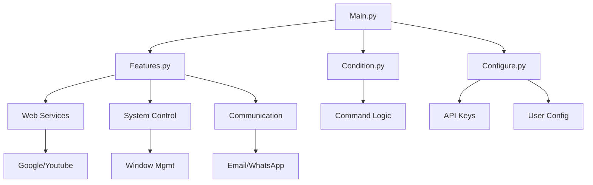

<div align="center">
  
  
  
  
  <h1>✨ J.A.R.V.I.S. ✨</h1>
  <h3>Just A Rather Very Intelligent System</h3>
  
  [](https://github.com/codewithcc/Jarvis-Assistant/stargazers)
  [](LICENSE)
</div>

---

## 🎩 Meet Your Personal Assistant
> "At your service! What can I do for you today?"

JARVIS is a voice-controlled AI assistant that helps you:
- 🔍 Search the web (Google/YouTube/Wikipedia)
- 📧 Manage communications (Email/WhatsApp)
- ⏰ Handle productivity (Reminders/Calendar)
- 🌤️ Provide real-time information (Weather/News)
- 🎵 Control media (Music/Spotify)
- 💻 Manage your system (Screenshots/Windows)

---

## 🚀 Quick Start

### Installation
```bash
git clone https://github.com/codewithcc/Jarvis-Assistant.git
cd Jarvis-Assistant
python -m venv jarvis-env
source jarvis-env/bin/activate  # Linux/Mac
jarvis-env\Scripts\activate     # Windows
pip install -r requirements.txt
```
### Configuration

1.  Get API keys:
    
    -   [OpenWeatherMap](https://openweathermap.org/api)
    -   [NewsAPI](https://newsapi.org/)
        
2.  Add them to  `Configure.py`  or environment variables

### Launch
```bash
python Main.py
```
_Say "Hey Jarvis" to activate!_
## 🌟 Feature Highlights

<table> <tr> <td align="center" width="150">  <br><strong>Web Search</strong> <p>Google/YouTube/Wikipedia</p> </td> <td align="center" width="150">  <br><strong>WhatsApp</strong> <p>Send messages & images</p> </td> <td align="center" width="150">  <br><strong>System Control</strong> <p>Screenshots/window management</p> </td> </tr> <tr> <td align="center" width="150">  <br><strong>Weather</strong> <p>Real-time forecasts</p> </td> <td align="center" width="150">  <br><strong>News</strong> <p>Latest headlines</p> </td> <td align="center" width="150">  <br><strong>System Info</strong> <p>IP address/hardware details</p> </td> </tr> </table>

## 🏗️ Project Architecture


<table> <tr> <td width="200" align="center">  <br><b>Main.py</b> <p>Entry point<br>Voice loop</p> </td> <td width="200" align="center">  <br><b>Features.py</b> <p>All command<br>implementations</p> </td> <td width="200" align="center">  <br><b>Configure.py</b> <p>API keys<br>User preferences</p> </td> </tr> <tr> <td align="center">  <br><b>Condition.py</b> <p>Command<br>recognition</p> </td> <td align="center">  <br><b>Data.json</b> <p>User data<br>cache</p> </td> <td align="center">  <br><b>requirements.txt</b> <p>Dependencies<br>list</p> </td> </tr> </table>

## 🛠️ Tech Stack

<div align="center">     </div>

## 🤝 How to Contribute

1.  Fork the repository
    
2.  Create a feature branch (`git checkout -b feature/AmazingFeature`)
    
3.  Commit your changes (`git commit -m 'Add feature'`)
    
4.  Push to the branch (`git push origin feature/AmazingFeature`)
    
5.  Open a Pull Request

## 📜 License

MIT ©  [Chanchal Roy](https://github.com/codewithcc)  
_Free for personal and commercial use_

----------

<div align="center"> <h3>💬 Need Help?</h3> <p> <a href="https://github.com/codewithcc/Jarvis-Assistant/issues">Report Bug</a> • <a href="https://github.com/codewithcc/Jarvis-Assistant/discussions">Ask Questions</a> • <a href="https://github.com/codewithcc">Follow Developer</a> </p> <p>⭐ <b>Star the project if you find it useful!</b> ⭐</p> </div>
